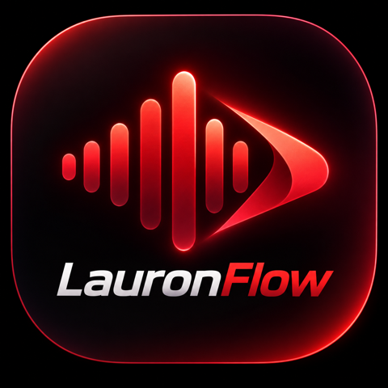

# LauronFlow

<p align="center">
  
</p>

A local, fully-offline voice dictation app for macOS (Apple Silicon). Hold a global
hotkey anywhere, speak, release — the transcript is typed into whatever app has focus.
No cloud calls, no telemetry, no account.

Speech-to-text runs on-device via [Parakeet TDT](https://huggingface.co/mlx-community/parakeet-tdt-0.6b-v3)
(NVIDIA, via Apple's MLX), spawned as a local Python sidecar process the Swift menu bar
app talks to over a Unix socket.

**Requirements:** Apple Silicon Mac, macOS 14+.

This is a personal project shared for testing among friends — it isn't notarized or
distributed through the App Store, so there's a bit of one-time setup either way below.

## Option A: Download the prebuilt release (easiest)

The release `.app` is self-contained — the speech-to-text sidecar is bundled inside it,
so there's no separate repo to clone.

1. Grab the latest `LauronFlow.app.zip` from [Releases](../../releases), unzip it, and
   drag `LauronFlow.app` into `/Applications`.
2. It's signed with a personal self-signed certificate, not an Apple Developer ID, so
   Gatekeeper will refuse to open it normally. Bypass that once with:
   ```
   xattr -cr /Applications/LauronFlow.app
   ```
   (or right-click the app → Open → Open, on the "unidentified developer" prompt).
3. Install the two runtime dependencies the sidecar needs:
   ```
   brew install uv ffmpeg
   ```
4. Launch LauronFlow from `/Applications`. First launch downloads the ~600MB Parakeet
   model from Hugging Face, so it can take a minute and needs internet the first time.
5. Grant permissions when prompted: **Microphone** and **Accessibility** (System
   Settings → Privacy & Security). Accessibility is required for typing the transcript
   into other apps — without it LauronFlow can transcribe but can't inject text.

Working on the sidecar itself and want the app to use your own checkout instead of the
bundled copy? Clone [lauronflow-sidecar](https://github.com/lauronjohn/lauronflow-sidecar)
and point the app at it with `./configure-sidecar.sh /path/to/lauronflow-sidecar`
(`configure-sidecar.sh` is in this repo).

## Option B: Build from source

Prerequisites:
```
xcode-select --install          # Xcode command line tools (or install Xcode from the App Store)
brew install xcodegen uv ffmpeg
```

Building requires a local code-signing certificate (self-signed, no Apple Developer
account needed) — this is what lets macOS remember your Accessibility/Microphone grants
across rebuilds instead of re-prompting every time. One-time setup:

1. Open **Keychain Access** → menu **Certificate Assistant → Create a Certificate…**
2. Name: `LauronFlow Local Dev`, Identity Type: **Self Signed Root**, Certificate Type:
   **Code Signing**. Create it, leave everything else default.

Then:
```
git clone https://github.com/lauronjohn/LauronFlow.git LauronFlow
git clone https://github.com/lauronjohn/lauronflow-sidecar.git LauronFlow/sidecar
cd LauronFlow
./install.sh
```

`install.sh` generates the Xcode project, builds, code-signs, and installs to
`/Applications/LauronFlow.app`, and records this checkout's `sidecar/` path so the app
can find it. Re-run it any time you pull new changes.

Grant Microphone + Accessibility permissions on first launch, same as Option A.

## Using it

- Hold **Right Option (⌥)**, speak, release — the transcript is typed wherever your
  cursor is focused. A floating widget shows a live waveform while recording.
- An undo hotkey (default **⌃ Control + ⌥ Option + Z**) removes the last thing LauronFlow
  typed, in case a transcription is wrong.
- Menu bar icon shows state (idle / recording / transcribing / error) and has a
  **Settings…** window with three tabs:
  - **General** — Launch at Login, show/hide the floating recording widget, and a quick
    on/off switch for vocabulary replacements.
  - **Vocabulary** — a custom find/replace list for words the model consistently
    mishears (names, jargon, etc.), applied before the transcript is typed.
  - **Shortcuts** — a reference for the current hotkey bindings.

## Troubleshooting

- **Nothing happens when I hold the hotkey / no menu bar icon appears:** check
  `~/Library/Application Support/LauronFlow/sidecar.log` for sidecar startup errors.
- **"Could not locate the `uv` executable":** `uv` isn't on `PATH` — install it with
  `brew install uv` (or check `SidecarPaths.swift`'s `resolveUvExecutable()` for the
  paths it searches).
- **Transcribed but couldn't type it:** grant Accessibility permission in System
  Settings → Privacy & Security → Accessibility, and make sure no secure input field
  (e.g. a password box) has focus.
